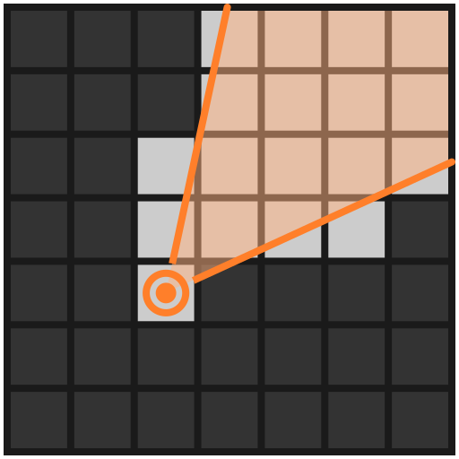
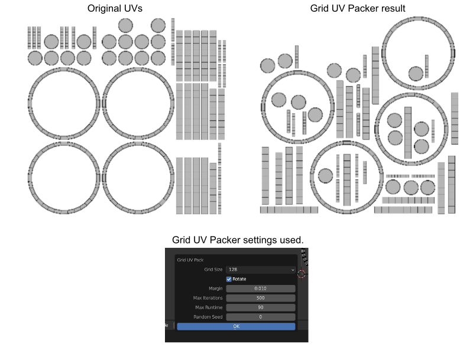

# Grid UV Packer

**Deprecation Warning: Blender 3.6.0 has this functionality built-in.  You are advised to uninstall this addon.**

-----

A pure-Python UV packer that packs irregularly shaped UV islands efficiently.

grid-uv-packer is released with [GPL license](./COPYING.txt), same as
[Blender](https://www.blender.org/about/license/)

## Features

- Packs UV islands trying to utilize all available space.
- Uses multi-processing to run multiple iterations in parallel.

## Installation

- Download the source zip from [releases
  page](https://github.com/muhuk/grid-uv-packer/releases).  You need to click
  to expand `Assets` under the correct version and download the file named
  `guvp-#.#.zip` (where #.# is the version number)
- In Blender, open `Preferences` editor (`Edit -> Preferences`
  from the menu).
- Click `Install...` button and choose the zip file you have downloaded.
- Once the addon is installed, you **must** still enable it manually in
  `Preferences` view.  It is not automatically enabled.
- After installation, you can delete the zip file you have downloaded.

## Usage

Once you enable the addon, in UV editor a `Grid UV Pack` command will be
available under `UV` menu.  This command will create a modal dialog where you
can adjust operator parameters.  Operator will start to run once you click
`OK` on this modal dialog.

Note that operator only packs selected islands, same behavior as `Pack Islands`.

### Parameters

*Pack to*
: This is same as `Pack Islands` operator.  `Closest UDIM` packs into the tile
  closest to the selection's center, `Active UDIM` packs into the active tile
  (if a tiled image is loaded) or the tile closest to 2D cursor.

*Grid Size*
: Resolution of the grid used by the algorithm.  Increasing this parameter can
  result in more tightly packed UV maps at the cost of time.  This parameter
  should be adjusted with 2 things in mind; the number of islands and image
  dimensions.  As a rough estimate `64` and `128` is good for 1K images, `512`
  should only be used for 8K textures for very dense meshes.

*Rotate*
: Whether to rotate islands or not during packing.  This is same as `Pack Islands`.

*Margin*
: Spacing (in terms of UV space) in between islands.  Althogh `Pack Islands`
  also have a parameter with the same name, it works differently in this
  operator.  Margin is taken into account, but the result might have more spacing.

*Max Iterations*
: Maximum number of iterations.  When the calculation ends, result with the
  best coverage will be used.  Due to brute force nature of this operator,
  setting this to a low number will yield poor results, expecially with UV
  maps with many islands.  Note that calculation may be stopped before this
  number of iterations are run.

*Max Runtime*
: Maximum amount of time the calculation is allowed to run.  Set this to `0`
  to disable time limit.

*Random Seed*
: Seed used to initialize the random number generator.  If this is set to `0`
  a random number will be generated every time you run the operator.  You
  don't need to modify this normally.
